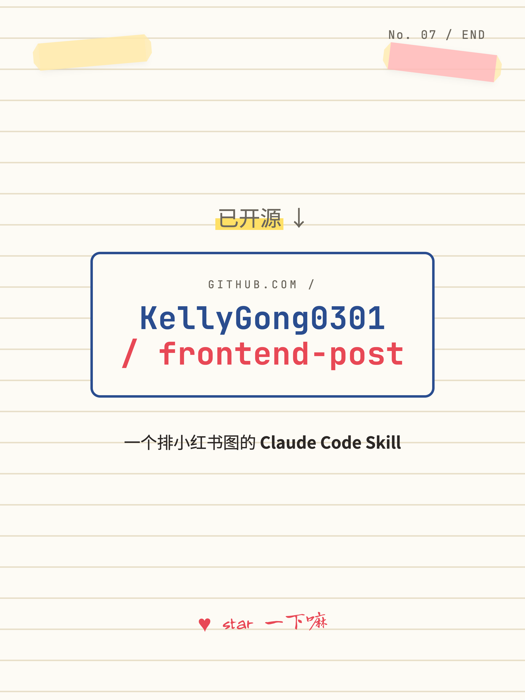

# frontend-post

> 一个 **Claude Code Skill**，将文本内容自动排版为小红书风格的图文卡片（1080×1440 / 1080×1080）。配色、字体、装饰、留白与构图均可由用户控制。

🇨🇳 中文用户可直接往下阅读，本文档以中文为主。

<p align="center">
  
  
  
  
</p>

<p align="center">
  <em>↑ 使用 frontend-post 自身生成的项目宣发图（校园手账风）。完整 7 张见 <a href="docs/preview/">docs/preview/</a>，源文件见 <a href="examples/notebook-demo/">examples/notebook-demo/</a>。</em>
</p>

---

## 简介

frontend-post 是一个面向中文创作者的排版工具，定位为**排版执行器，而非内容生成器**。

- 用户提供文案与风格偏好，skill 按既定规则将其排版为图片
- 内容主导权完全保留在用户手中，AI 仅承担布局与样式落地
- 配色、字体、装饰元素、留白比例、卡片尺寸均可定制

本项目不会替用户生成"AI 风格"的口水文案。

## 风格预设

提供 12 套经过策划的风格，覆盖常见使用场景：

| 风格 | 调性 | 适用场景 |
|---|---|---|
| 奶油拿铁 | 温柔治愈 | 早餐 / 咖啡 / 读书笔记 |
| 莫兰迪 | 高级灰调 | 穿搭 / 家居 / 方法论 |
| 多巴胺 | 鲜亮活泼 | 情绪 / 周末 / 学习打卡 |
| 校园手账 | 学生手写 | 笔记 / 干货 / 考试 |
| 极简黑白 | 高级商务 | 职场 / 干货 / 摄影 |
| 港风胶片 | 复古时尚 | 穿搭 / 旅游 / 城市 |
| 杂志大字 | 编辑感 | 观点 / 金句 / 文案 |
| 暗黑科技 | 科技博主 | AI / 编程 / 工具评测 |
| 国风水墨 | 国风文艺 | 诗词 / 茶 / 节气 |
| 日系治愈 | 治愈安静 | 早安晚安 / 心情 |
| 复古杂志 | 文艺杂志 | 书影音 / 慢生活 |
| 咖啡店黑板 | 手写黑板 | 食谱 / 探店 / 课表 |

完整规范（配色、字体、装饰元素）参见 [`references/STYLE_PRESETS.md`](references/STYLE_PRESETS.md)。

## 安装与使用

### 1. 安装 Skill

将仓库克隆至 Claude Code 的 skills 目录：

```bash
git clone https://github.com/KellyGong0301/frontend-post.git ~/.claude/skills/frontend-post
```

亦可手动将 `frontend-post/` 目录复制至 `~/.claude/skills/` 下。

### 2. 在 Claude Code 中调用

直接以自然语言描述需求即可：

> "帮我做一组小红书图，主题是 XXX，风格用奶油拿铁。"

Skill 将自动触发，确认内容、张数与比例后生成 `index.html` 预览。

### 3. 浏览器内调整

生成的 HTML 在 `:root` 中暴露所有样式变量：

```css
:root {
  --bg: #F5EFE6;          /* 背景色 */
  --ink: #4A3520;         /* 文字色 */
  --accent: #D97757;      /* 强调色 */
  --font-display: "ZCOOL XiaoWei", serif;  /* 标题字体 */
  --font-body: "Noto Serif SC", serif;     /* 正文字体 */
}
```

修改上述变量即可整体换风格。也可继续以自然语言指示 Claude 调整版式。

### 4. 导出 PNG

**方式 A — Node（推荐）**：复用系统 Chrome，无需额外下载二进制。

```bash
cd output
npm init -y && npm install puppeteer-core
node ~/.claude/skills/frontend-post/scripts/render.js index.html png_output
```

**方式 B — Python**：跨平台稳定，需下载 Chromium（约 200MB）。

```bash
pip install playwright && playwright install chromium
python ~/.claude/skills/frontend-post/scripts/render.py output/index.html output/png
```

输出：`png_output/card_01.png … card_NN.png`，单张分辨率 2160×2880（Retina 2×），上传小红书不会模糊。

## 目录结构

```
frontend-post/
├── SKILL.md                          # 主流程定义（供 Claude 读取）
├── README.md                         # 当前文档
├── CHANGELOG.md                      # 版本更新记录
├── LICENSE                           # MIT
├── references/
│   ├── STYLE_PRESETS.md              # 12 套风格的 CSS / 字体 / 装饰规范
│   └── HOOK_PATTERNS.md              # 9 种封面标题钩子公式
├── scripts/
│   ├── render.js                     # Node + puppeteer-core 渲染器
│   └── render.py                     # Python + Playwright 渲染器
├── examples/
│   └── notebook-demo/                # 7 张校园手账风样例（HTML + 说明）
└── docs/
    └── preview/                      # 渲染好的预览 PNG
```

## 设计原则

1. **强约束优于自由发挥**：每张卡片设有字数硬上限，超量自动拆分，避免 LLM 把内容溢出隐藏。
2. **精选模板优于通用风格**：提供 12 套人格化预设，并明确禁用 AI 通用紫蓝渐变与系统默认字体。
3. **用户控制优于 AI 自动**：所有风格变量暴露于 `:root`，用户可随时调整。
4. **像素固定优于响应式**：严格按 1080×1440 像素出图，保证 PNG 不变形。

## License

[MIT](LICENSE) — 允许自由使用、修改、分发。

## 致谢

- 灵感来源：[**frontend-slides**](https://github.com/zarazhangrui/frontend-slides)（[Zara Zhang](https://github.com/zarazhangrui)）的 Skill 设计方法论。
- 中文字体：[Google Fonts CJK](https://fonts.google.com/?subset=chinese-simplified)、[LXGW WenKai](https://github.com/lxgw/LxgwWenKai)。
- 渲染引擎：[Puppeteer](https://pptr.dev/) / [Playwright](https://playwright.dev/)。

如本项目对你有帮助，欢迎点 Star 支持。
